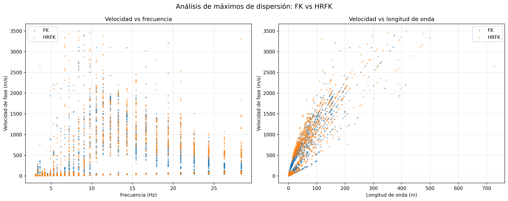

# MAM-Uncertainty-Analysis

Python workflow for processing passive seismic surface-wave dispersion peaks using the **Microtremor Array Method (MAM)**.

The workflow uses **Geopsy** for FK and HRFK processing and [`swprocess`](https://github.com/jpvantassel/swprocess) for Python-based extraction, JSON export, and visualization.

## Workflow

```text
Passive seismic data
        ↓
      Geopsy
        ↓
   FK / HRFK
        ↓
      .max
        ↓
   swprocess
        ↓
   JSON + Figure
```

## Dataset

* 23-channel passive seismic array
* 3 m sensor spacing
* 66 m array length
* Sampling interval: 0.004 s
* Wave type: Rayleigh
* Instrument: PASI Gea24

## Results

The workflow preserves the complete set of dispersion maxima identified by FK and HRFK processing.

### FK vs HRFK dispersion



The figure compares phase velocity as a function of frequency and wavelength for the FK and HRFK results.

## Project structure

```text
MAM-Uncertainty-Analysis/
├── data/
│   ├── ReMi_Tome_1.dat
│   ├── tome_fk_vt.max
│   └── tome_hfk_vt.max
├── figures/
│   └── tome_fk_vs_hfk_dispersion.png
├── results/
│   ├── tome_rayleigh_fk.json
│   └── tome_rayleigh_hfk.json
├── mam_processing.py
├── .gitignore
└── README.md
```

## Requirements

```bash
pip install swprocess matplotlib
```

Run the processing with:

```bash
python mam_processing.py
```

## References

* Aki, K. (1957). *Space and Time Spectra of Stationary Stochastic Waves, with Special Reference to Microtremors*. Bulletin of the Earthquake Research Institute, University of Tokyo, 35(3), 415–456. https://doi.org/10.15083/0000033938

* Capon, J. (1969). *High-resolution frequency-wavenumber spectrum analysis*. Proceedings of the IEEE, 57(8), 1408–1418. https://doi.org/10.1109/PROC.1969.7278

* Lacoss, R. T., Kelly, E. J., & Toksöz, M. N. (1969). *Estimation of seismic noise structure using arrays*. Geophysics, 34(1), 21–38. https://doi.org/10.1190/1.1439995

* Vantassel, J. P., & Cox, B. R. (2022). *SWprocess: a workflow for developing robust estimates of surface wave dispersion uncertainty*. Journal of Seismology, 26, 731–756. https://doi.org/10.1007/s10950-021-10035-y

* Wathelet, M., Chatelain, J.-L., Cornou, C., Di Giulio, G., Guillier, B., Ohrnberger, M., & Savvaidis, A. (2020). *Geopsy: A user-friendly open-source tool set for ambient vibration processing*. Seismological Research Letters, 91(3), 1878–1889.
